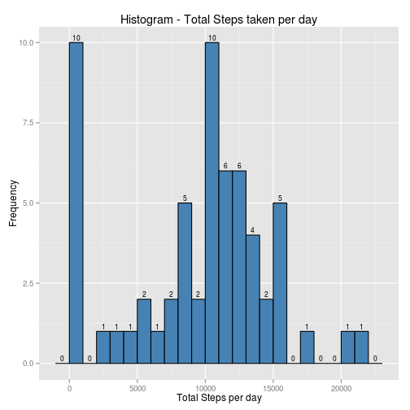
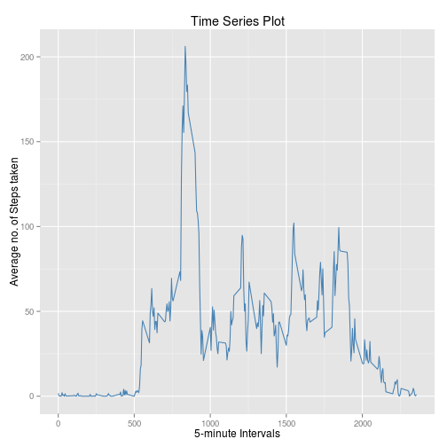
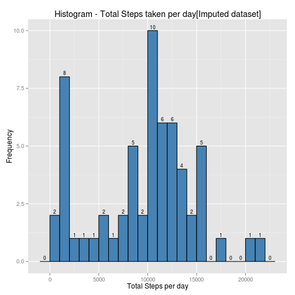
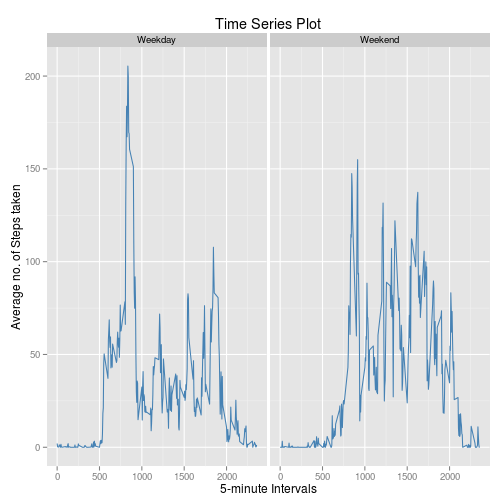

# Reproducible Research:PeerAssesment1
____________________________________
### 1. Loading and preprocessing the data
* Load data:
  Read the file in **activity.zip** using the *"unz"* function and then create a dataframe using *"read.csv"* function.

```r
zFile <- unz("activity.zip","activity.csv")
activityData <- read.csv(zFile)
str(activityData)
```

```
## 'data.frame':	17568 obs. of  3 variables:
##  $ steps   : int  NA NA NA NA NA NA NA NA NA NA ...
##  $ date    : Factor w/ 61 levels "2012-10-01","2012-10-02",..: 1 1 1 1 1 1 1 1 1 1 ...
##  $ interval: int  0 5 10 15 20 25 30 35 40 45 ...
```
* Preprocess data:
  Convert the type for "date" column from *factor* to *Date*.

```r
activityData$date <-as.Date(activityData$date,"%Y-%m-%d")
str(activityData)
```

```
## 'data.frame':	17568 obs. of  3 variables:
##  $ steps   : int  NA NA NA NA NA NA NA NA NA NA ...
##  $ date    : Date, format: "2012-10-01" "2012-10-01" ...
##  $ interval: int  0 5 10 15 20 25 30 35 40 45 ...
```
***

### 2. What is mean total number of steps taken per day?
* Using *plyr* package for summarising Total steps taken each day (ignoring NA values) and *ggplot2* package for plotting histogram.

```r
library(plyr)
library(ggplot2)
## Summarise mean of steps for each day.
tempData <- ddply(activityData,"date",summarise,TotalSteps=sum(steps,na.rm=T))
str(tempData)
```

```
## 'data.frame':	61 obs. of  2 variables:
##  $ date      : Date, format: "2012-10-01" "2012-10-02" ...
##  $ TotalSteps: int  0 126 11352 12116 13294 15420 11015 0 12811 9900 ...
```
* Histogram of Total number of steps taken each day.

```r
## Create histogram with binwidth = 1000.
p <- ggplot(data=tempData,aes(x=TotalSteps))+geom_histogram(aes(y=..count..),binwidth=1000,fill='steelblue',color='black')
## Add proper labels to plot.
p <- p + labs(title="Histogram - Total Steps taken per day",x="Total Steps per day",y="Frequency")
## Label each bar with Frequency counts.
p <- p + stat_bin(binwidth = 1000,geom = "text",aes(label=..count..),vjust=-0.4,size=3)
print(p)
```

 
  
* Mean Total number of steps taken per day.

```r
paste("Mean Total number of Steps taken per day:",mean(tempData$TotalSteps))
```

```
## [1] "Mean Total number of Steps taken per day: 9354.22950819672"
```
* Median for Total number of steps taken per day.

```r
paste("Median Total number of Steps taken per day:",median(tempData$TotalSteps))
```

```
## [1] "Median Total number of Steps taken per day: 10395"
```
***


### 3. What is the average daily activity pattern?
* Time series plot of 5-minute interval and average number of steps taken, averaged across all days.

```r
## Summarise mean of steps across all days for each interval.
intervalAvgData <- ddply(activityData,"interval",summarise,IntAvgSteps=mean(steps,na.rm=T))
str(intervalAvgData)
```

```
## 'data.frame':	288 obs. of  2 variables:
##  $ interval   : int  0 5 10 15 20 25 30 35 40 45 ...
##  $ IntAvgSteps: num  1.717 0.3396 0.1321 0.1509 0.0755 ...
```

```r
## Time series plot.
p <- ggplot(intervalAvgData,aes(x=interval,y=IntAvgSteps))+geom_line(color="steelblue")
## Add proper labels to plot.
p <- p + labs(title="Time Series Plot",x="5-minute Intervals",y="Average no. of Steps taken")
print(p)
```

 

***

### 4. Imputing missing values
* Total number of missing values in dataset.

```r
paste("Total missing values in dataset:",sum(!complete.cases(activityData)))
```

```
## [1] "Total missing values in dataset: 2304"
```
* To impute missing value, replace each missing value for each interval with the median for that 5-minute interval over entire dataset.

```r
## Summarise median of steps across all days for each interval.
intMedianData <- ddply(activityData,"interval",summarise,IntMedianSteps=median(steps,na.rm=T))
str(intMedianData)
```

```
## 'data.frame':	288 obs. of  2 variables:
##  $ interval      : int  0 5 10 15 20 25 30 35 40 45 ...
##  $ IntMedianSteps: int  0 0 0 0 0 0 0 0 0 0 ...
```

```r
## Extract row indexes with NA values.
indexNAvalues <- which(!complete.cases(activityData))
activityDataFilled <- activityData
## Replace each missing value with the median value for that 5-minute interval.
for(index in indexNAvalues){
    activityDataFilled[index,1] <- intMedianData[which(intMedianData[,1] == activityDataFilled[index,3]),2]
  }
```
* New dataset with missing data filled.

```r
summary(activityDataFilled)
```

```
##      steps          date               interval     
##  Min.   :  0   Min.   :2012-10-01   Min.   :   0.0  
##  1st Qu.:  0   1st Qu.:2012-10-16   1st Qu.: 588.8  
##  Median :  0   Median :2012-10-31   Median :1177.5  
##  Mean   : 33   Mean   :2012-10-31   Mean   :1177.5  
##  3rd Qu.:  8   3rd Qu.:2012-11-15   3rd Qu.:1766.2  
##  Max.   :806   Max.   :2012-11-30   Max.   :2355.0
```

```r
paste("Total missing values in dataset:",sum(!complete.cases(activityDataFilled)))
```

```
## [1] "Total missing values in dataset: 0"
```
* Histogram of Total number of steps taken each day [Imputed dataset].

```r
tempData1 <- ddply(activityDataFilled,"date",summarise,TotalSteps=sum(steps))
## Create histogram with binwidth = 1000.
p <- ggplot(data=tempData1,aes(x=TotalSteps))+geom_histogram(aes(y=..count..),binwidth=1000,fill='steelblue',color='black')
## Add proper labels to plot.
p <- p + labs(title="Histogram - Total Steps taken per day[Imputed dataset]",x="Total Steps per day",y="Frequency")
## Label each bar with Frequency counts.
p <- p + stat_bin(binwidth = 1000,geom = "text",aes(label=..count..),vjust=-0.4,size=3)
print(p)
```

 

* Mean Total number of steps taken per day [Imputed dataset].

```r
paste("Mean Total number of Steps taken per day:",mean(tempData1$TotalSteps))
```

```
## [1] "Mean Total number of Steps taken per day: 9503.86885245902"
```
* Median for Total number of steps taken per day [Imputed dataset].

```r
paste("Median Total number of Steps taken per day:",median(tempData1$TotalSteps))
```

```
## [1] "Median Total number of Steps taken per day: 10395"
```
* The Mean values for Total no. of steps taken per day of original and imputed dataset differ.However the Median values of original and imputed datasets are same.

```r
library(xtable)
df <- data.frame(Original.dataset=c(mean(tempData$TotalSteps),median(tempData1$TotalSteps)),Imputed.dataset=c(mean(tempData1$TotalSteps),median(tempData1$TotalSteps)),row.names=c("Mean","Median"))
print(xtable(df),type="html",html.table.attributes="border=2")
```

<!-- html table generated in R 3.1.1 by xtable 1.7-4 package -->
<!-- Mon Nov 17 02:38:35 2014 -->
<table border=2>
<tr> <th>  </th> <th> Original.dataset </th> <th> Imputed.dataset </th>  </tr>
  <tr> <td align="right"> Mean </td> <td align="right"> 9354.23 </td> <td align="right"> 9503.87 </td> </tr>
  <tr> <td align="right"> Median </td> <td align="right"> 10395.00 </td> <td align="right"> 10395.00 </td> </tr>
   </table>

* **Impact of Imputing missing data**
    + Then Mean value for Total no. of steps taken per day is increased.
    + The frequency for Total no. steps between 1000-1999 taken per day is increased *(check histogram)*.

***
### 5. Are there differences in activity patterns between weekdays and weekends?
* Create new factor variable *"day"* with two levels - "weekday" and "weekend", using the dataset with the filled-in missing values.

```r
## Use the weekdays functions to extract days of week.
tDays <- weekdays(activityDataFilled$date)
## create a logical vector with TRUE value when day is weekend else FALSE.
tLogicalDay <- (tDays=="Sunday"|tDays=="Saturday")
## create factor variable "day" from logical vector.
activityDataFilled$day <- factor(tLogicalDay,levels = sort(unique(as.character(tLogicalDay))),labels = c("Weekday","Weekend"))
str(activityDataFilled)
```

```
## 'data.frame':	17568 obs. of  4 variables:
##  $ steps   : int  0 0 0 0 0 0 0 0 0 0 ...
##  $ date    : Date, format: "2012-10-01" "2012-10-01" ...
##  $ interval: int  0 5 10 15 20 25 30 35 40 45 ...
##  $ day     : Factor w/ 2 levels "Weekday","Weekend": 1 1 1 1 1 1 1 1 1 1 ...
```

* Panel plot containing a time series plot of the 5-minute interval and the average number of steps taken.

```r
## Summarise mean of steps across all days for each interval.
intervalAvgData1 <- ddply(activityDataFilled,c("day","interval"),summarise,IntAvgSteps=mean(steps))
str(intervalAvgData1)
```

```
## 'data.frame':	576 obs. of  3 variables:
##  $ day        : Factor w/ 2 levels "Weekday","Weekend": 1 1 1 1 1 1 1 1 1 1 ...
##  $ interval   : int  0 5 10 15 20 25 30 35 40 45 ...
##  $ IntAvgSteps: num  2.0222 0.4 0.1556 0.1778 0.0889 ...
```

```r
## Time series plot.
p <- ggplot(intervalAvgData1,aes(x=interval,y=IntAvgSteps))+geom_line(color="steelblue")+facet_wrap(~ day)
## Add proper labels to plot.
p <- p + labs(title="Time Series Plot",x="5-minute Intervals",y="Average no. of Steps taken")
print(p)
```

 

* **Yes there are differences in activity patterns between weekdays and weekends.**

***
